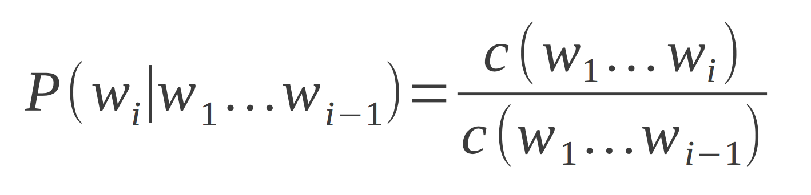
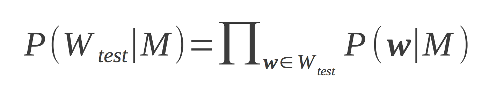
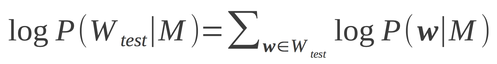

## Topic 2: Basics of Language Models

#### A language model is a form of speech recognition system used by NLP for a certain language.

### In a basic form of a language model, we can find the probability by:
> P(|W| = 4, w1 = "hi", w2 = "this", w3 = "is", w4 = "Nicholas")

Where W is the language model.
**Note** -> w0 is a start tag to signalize the start of the sentence.
**Same goes for w5 as an end tag to signalize the end of the sentence.**

#### By using Incremental Computation, we'll have an equation:

That looks confusing. So the main point is, how do we get the probability?

##### We'll compute the probability by what's called the:
## Maximum Likelihood Estimation (ML Estimation).

W is the sentence that we're analyzing.

In this example:
> **##Start## This is Nicholas ##End##**

Let's say i = 2, this means that we're accessing "is".

> **P(is | ##Start## This) = C (##Start## This is) / C (##Start## This)**

C (aka Count) is equal the number of times this word has appeared with the machine.

This is the resultant equation we will get.

#### However, such an equation will result in weak probabilities when the counts are low.
- Unknown words will often be ignored

Thus, we have the **Likelihood** Probability to increase model accuracy.

- However, as the numbers calculated with likelihood are low, this may result in integer underflow. This can be resolved with **Log likelihood**.

- This way, a high level of accuracy can be obtained while maintaining high levels of data integrity.

##### References
